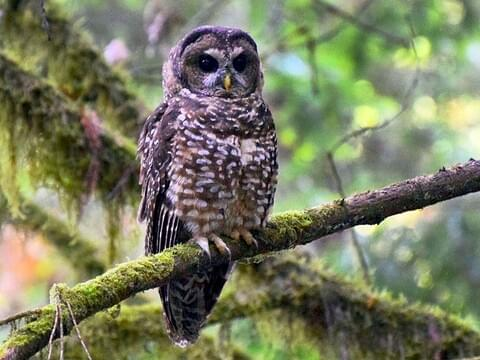

## Story Map

The story map created for this lab details the threats faced by the California spotted owl. 


In order to create this story map, the necessary libraries must first be imported
### Required Libraries

- jQuery: is a JavaScript library that greatly simplifies JavaScript programming.

- [Scrollama](https://github.com/russellgoldenberg/scrollama): is a modern & lightweight JavaScript library for scrolly telling using IntersectionObserver in favor of scroll events.

- Leaflet: provides a popular map framework. You can also use MapBox, ESRI javascript API, Cesium, other map/virtual globe frameworks.

- [Font Awesome 4.7](https://fontawesome.com/v4.7.0/icons/): offers a very large set of icons for multiple usages.

- Google Fonts: provides customized web fonts which you can externally link from Google servers.

- Bootstrap 4: provides additional web components, such as navigation bar, footer, etc.

- Chroma: makes color ramps for automatically generating map color schema.

Next, in the head element, create a title and include all the required stylesheets and javascript.

```python
!DOCTYPE html>
<html>

<head>
  <meta charset="utf-8" />
  <meta http-equiv="X-UA-Compatible" content="IE=edge" />
  <meta name="description" content="GeoNarrative Template" />
  <meta name="viewport" content="width=device-width, initial-scale=1" />
  <title>California Spotted Owl</title>
  <link rel="stylesheet" href="https://cdnjs.cloudflare.com/ajax/libs/font-awesome/4.7.0/css/font-awesome.css" />
  <link rel="stylesheet" href="https://fonts.googleapis.com/css2?family=Fira+Sans:ital,wght@0,400;0,500;1,400;1,500&display=swap" />
  <link rel="stylesheet" href="https://cdnjs.cloudflare.com/ajax/libs/leaflet/1.7.1/leaflet.min.css" />
  <link rel="stylesheet" href="css/main.css" />

  <script src="https://cdnjs.cloudflare.com/ajax/libs/jquery/3.5.1/jquery.min.js"></script>
  <script src="https://cdnjs.cloudflare.com/ajax/libs/scrollama/2.2.1/scrollama.min.js"></script>
  <script src="https://cdnjs.cloudflare.com/ajax/libs/leaflet/1.7.1/leaflet.min.js"></script>
</head>
```

Then, in the body section, set a background image for the cover page and write a short introduction. As mentioned, this story map details threats to the California Spotted Owl, so the introduction provides a quick synopsis on the species and the threats it faces. 
